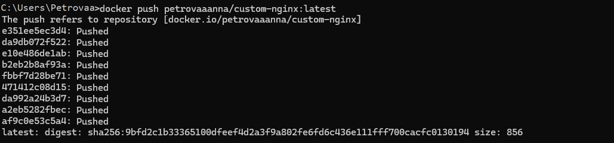

# 4. Работа с портáми и томáми

---

### 1. Создание контейнера nginx, создание контейнера с WSGI-сервером на Python (с помощью docker run ...).
   ```bash
      docker run -d --name nginx-container -p 8081:80 nginx
   ```
    
**WSGI-сервер на Python**
   ```bash
       docker run -it --name wsgi-container -p 8082:80 python:3.9-slim bash
       pip install flask
   ```
Создание Flask проекта:
   ```bash
      nano app.py
   ```

   ```python
    from flask import Flask
    app = Flask(__name__)
    
    @app.route("/")
    def hello():
        return "Hello World!"
   ```


### 2. Создание образа nginx из Dockerfile (docker build), создание образа WSGI-сервером на Python


```dockerfile
#NGINX
FROM nginx:alpine
```


```dockerfile
#Python
FROM python:3.9-slim
WORKDIR /app
COPY ./app.py /app/
RUN pip install flask
CMD ["flask", "run", "--host=0.0.0.0", "--port=80"]
```


### 3. Загрузка образа в докер хаб (Docker Hub). В отчете отобразить ссылку на образ с описанием.

### Образ NGINX:
```bash
docker push petrovaanna/custom-nginx:latest
```

### Образ WSGI:
```bash
docker push petrovaanna/custom-wsgi:latest
```


### Ссылки на образы в Dockerhub
Образ NGINX: [https://hub.docker.com/repository/docker/petrovaaanna/custom-nginx/general](https://hub.docker.com/repository/docker/petrovaaanna/custom-nginx/general)

Образ WSGI Python: [https://hub.docker.com/repository/docker/petrovaaanna/custom-wsgi/general](https://hub.docker.com/repository/docker/petrovaaanna/custom-wsgi/general)

### 4. Использование docker-compose при работе с несколькими образами/контейнерами, томами. Создать docker-compose.yaml и реализовать в нем запуск одновременно nginx и WSGI-сервером на Python на разных портах 8081 и 8082.

#### docker-compose.yaml
```yaml
version: '3'
services:
  nginx:
    image: petrovaaanna/custom-nginx:latest
    ports:
      - "8081:80"
    depends_on:
      - wsgi
  wsgi:
    image: petrovaaanna/custom-wsgi:latest
    ports:
      - "8082:80"
```
```bash
docker-compose up
```

 
